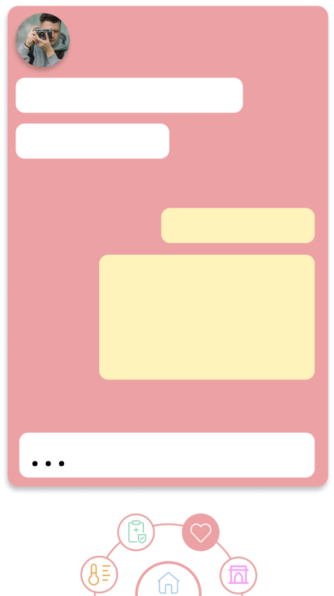
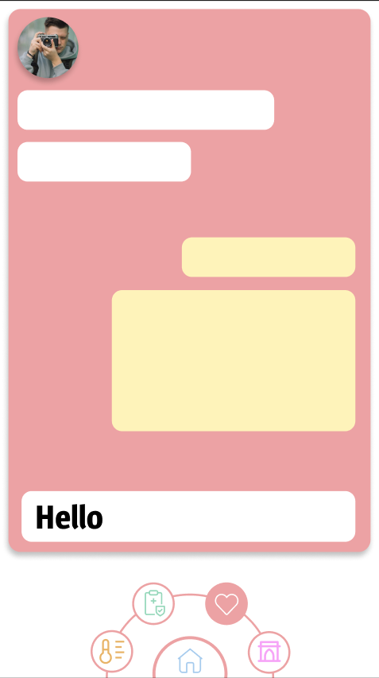
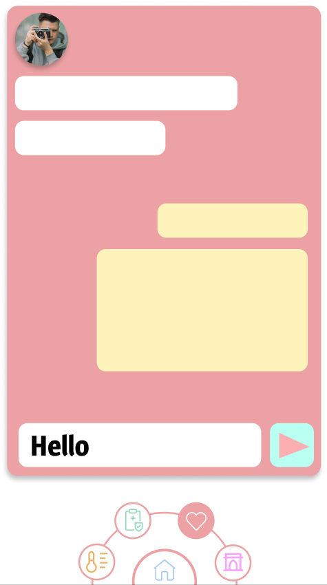
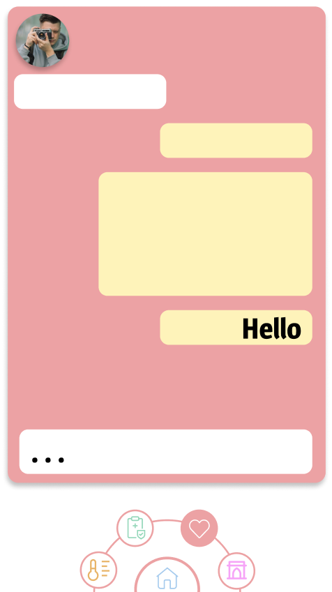

| NFR id | TC id | Опис кроків тестового сценарію                                                                                | Опис очікуваних результатів                |
|--------|-------|---------------------------------------------------------------------------------------------------------------|--------------------------------------------|
| NFR1.2 | TC1.5 | Початкові умови: відсутні Кроки сценарію: відсутні                                                         | Екрана форма:  |
| NFR1.2 | TC1.6 | Початкові умови: успішно пройдено ТС1.5  Кроки сценарію: 1) В текстове поле внесено значення *Hello* | Екрана форма:  |
| NFR1.2 | TC1.7 | Початкові умови: успішно пройдено ТС1.6  Кроки сценарію: 1) Свайп ліворуч на текстовому полі         | Екрана форма:  |
| NFR1.2 | TC1.8 | Початкові умови: успішно пройдено ТС1.7  Кроки сценарію: 1) Натиснуто клавішу відправки листа        | Екрана форма:  |